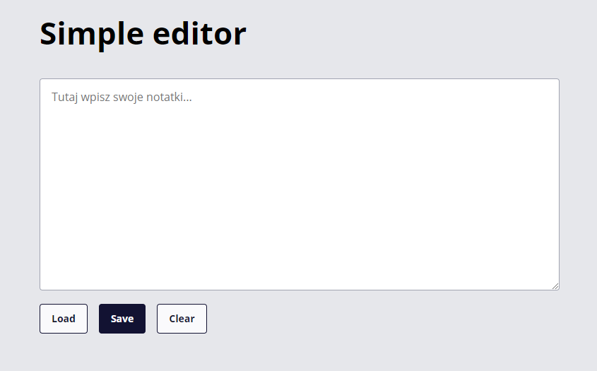

## Simple editor
    - Is an small website which is made as homework by my 6 year old nephew to show him how to use git
    - This very simple app is an notepad with save, load, and clear saved content funtionalities
    - Content is saved in localStorage
    
## Configuration
    To install dependecies use:
    ```sh
    $ npm install
    ```sh
    
    To run project use:
    ```sh
    $ npm run start
    ```sh
    
    To run project in production mode use:
    ```sh
    $ npm run build
    ```sh
    
    To publish project in github pages use:
    ```sh
    $ npm run publish
    ```sh

